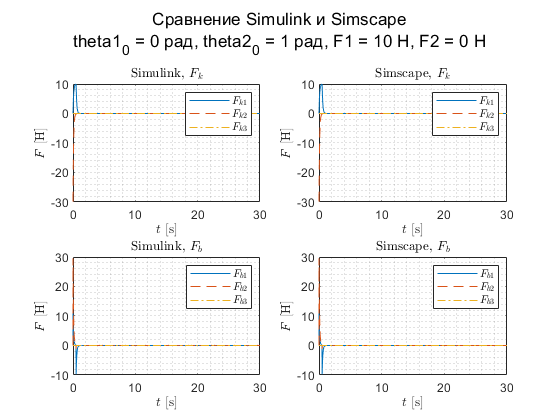

Дана система следующего вида:


Необходимо:

   1.  Вывести в аналитическом виде уравнение динамики системы; 
   2.  Собрать имитационную модель из блоков MATLAB Simulink; 
   3.  Собрать имитационную модель из блоков MATLAB Simscape; 
   4.  Сравнить поведение моделей посредством отклонения от положения равновесия тела x, 2x, 5x. Величина отклонения x выражена в метрах или радианах, значение выбирается самостоятельно 
   5.  Сравнить поведение моделей посредством импульсного внешнего воздействия при силе импульсного воздействия 10 Н и 0,5 секунды 

*Пункт 1. Вывод в аналитическом виде уравнение динамики системы*

Уравнение движение вывести, если составить Лагранжиан для системы L. Он представляет собой разность между кинетической и потенциальной энергией системы, общий вид:

$L(x,\dot{x} )=K(x,\dot{x} )-P(x)$, где $K(x,\dot{x} )$ - кинетическая энергия тела, $P(x)$ - потенциальная энерия тела и пружины. Тогда:

$$
Для\;первого\;тела\;L_1 =\frac{1}{2}j_1 {\dot{\theta} }_1^2 -\frac{1}{2}k_1 \theta_1^2 -\frac{1}{2}k_2 (\theta_2 -\theta_1 )^2
$$

$$
Для\;второго\;тела\;L_2 =\frac{1}{2}j_2 {\dot{\theta} }_2^2 -\frac{1}{2}k_3 \theta_2^2 -\frac{1}{2}k_2 (\theta_2 -\theta_1 )^2
$$

Уравнение для механической системы задаётся формулой:

$\frac{d}{dt}(\frac{\partial L}{\partial \dot{x} })-\frac{\partial L}{\partial x}=Q$, где $Q$ - внешняя сила, действующая на систему, которая в данной задаче является демфирующей силой. Тогда можно получить:

$$
\begin{array}{l}
\frac{d}{dt}(\frac{\partial L_1 }{\partial {\dot{\theta} }_1 })=j_1 {\ddot{\theta} }_1 ;\frac{\partial L_1 }{\partial \theta_1 }=-k_1 \theta_1 -k_2 (\theta_1 -\theta_2 )\\
\frac{d}{dt}(\frac{\partial L_2 }{\partial {\dot{\theta} }_2 })=j_2 {\ddot{\theta} }_2 ;\frac{\partial L_2 }{\partial \theta_2 }=-k_3 \theta_2 -k_2 (\theta_2 -\theta_1 )
\end{array}
$$

$$
\begin{array}{l}
Q_1 =-b_1 {\dot{\theta} }_1 -b_2 (\dot{\theta} 1-{\dot{\theta} }_2 )\\
Q_2 =-b_3 {\dot{\theta} }_2 -b_2 (\dot{\theta} 2-{\dot{\theta} }_1 )
\end{array}
$$

Итоговый вид системы следующий:

$$
\left\lbrace \begin{array}{c}
j_1 {\ddot{\theta} }_1 =-k_1 \theta_1 -k_2 (\theta_1 -\theta_2 )-b_1 {\dot{\theta} }_1 -b_2 (\dot{\theta} 1-{\dot{\theta} }_2 )\\
j_2 {\ddot{\theta} }_2 =-k_3 \theta_2 -k_2 (\theta_2 -\theta_1 )-b_3 {\dot{\theta} }_2 -b_2 (\dot{\theta} 2-{\dot{\theta} }_1 )
\end{array}\right.
$$
  

Задание начальных условий, вариант 53:

  

```matlab:Code
clc, clear all
j1 = 0.001379; j2 = 0.000376;
k1 = 45.24; k2 = 29.89; k3 = 1e-9;
b1 = 4.52; b2 = 2.69; b3 = 1e-9;

x1_0 = 0.5; x2_0 = 0.5;

F_1 = 0; F_2 = 10; % N
time_F_1 = 0.5; time_F_2 = 0.5; % s
t = 20; %s [simulation time]
x1 = [x1_0; 2 * x1_0; 5 * x1_0];
x2 = [x2_0; 2 * x2_0; 5 * x2_0];

```

  

Задача данных в лайв-скрипт

  

```matlab:Code
lab1
lab1sm

F_1 = 0; F_2 = 0;
x1_0 = x1(1); x2_0 = x2(1);
sim11 = sim('lab1');
sims1 = sim('lab1sm');

x1_0 = x1(2); x2_0 = x2(2);
sim12 = sim('lab1');
sims2 = sim('lab1sm');

x1_0 = x1(3); x2_0 = x2(3);
sim13 = sim('lab1');
sims3 = sim('lab1sm');

x1_0 = 0; x2_0 = 0; F_2 = 10; F_1 = 10;
sim14 = sim('lab1');
sims4 = sim('lab1sm');

x1_0 = 0; x2_0 = 0; F_2 = 10; F_1 = 0;
sim15 = sim('lab1');
sims5 = sim('lab1sm');

x1_0 = 1; x2_0 = 0; F_2 = 0; F_1 = 0;
sim16 = sim('lab1');
sims6 = sim('lab1sm');

x1_0 = 0; x2_0 = 1; F_2 = 0; F_1 = 10;
sim17 = sim('lab1');
sims7 = sim('lab1sm');
```

  

Сравнение Simulink и Simscape, изменение начальных данных

  

```matlab:Code
figure;
subplot(2,2,1)
plot(sim11.simout.theta_1.time, sim11.simout.theta_1.data)
grid minor
hold on
plot(sim11.simout.theta_2.time, sim11.simout.theta_2.data,'LineStyle','--')
legend('$\theta_1$','$\theta_2$', 'interpreter','latex')
xlabel('$t$ [s]','Interpreter',"latex")
ylabel('$\theta$ [rad]','Interpreter',"latex")
title('Simulink, $\theta$', 'Interpreter',"latex")
subplot(2,2,3)
plot(sim11.simout.w1.time, sim11.simout.w1.data)
grid minor
hold on
plot(sim11.simout.w2.time, sim11.simout.w2.data,'LineStyle','--')
legend('$\omega_1$','$\omega_2$', 'interpreter','latex')
xlabel('$t$ [s]','Interpreter',"latex")
ylabel('$\omega$ [rad/s]','Interpreter',"latex")
title('Simulink, $\omega$', 'Interpreter',"latex")

subplot(2,2,2)
plot(sims1.simout.theta1.time, sims1.simout.theta1.data)
hold on
plot(sims1.simout.theta2.time, sims1.simout.theta2.data,'LineStyle','--')
grid minor
legend('$\theta_1$','$\theta_2$', 'interpreter','latex')
xlabel('$t$ [s]','Interpreter',"latex")
ylabel('$\theta$ [rad]','Interpreter',"latex")
title('Simscape, $\theta$', 'Interpreter',"latex")
subplot(2,2,4)
plot(sims1.simout.w1.time, sims1.simout.w1.data)
hold on
plot(sims1.simout.w2.time, sims1.simout.w2.data,'LineStyle','--')
legend('$\omega_1$','$\omega_2$', 'interpreter','latex')
xlabel('$t$ [s]','Interpreter',"latex")
ylabel('$\omega$ [rad/s]','Interpreter',"latex")
title('Simscape, $\omega$', 'Interpreter',"latex")
grid minor
sgtitle({['Сравнение Simulink и Simscape']; ['theta1_0 = ', num2str(x1(1)),' рад, theta2_0 = ', num2str(x2(1)), ' рад, '...
    'F1 = ', num2str(0), ' H, F2 = ', num2str(0), ' H']})
```


```matlab:Code
figure;
subplot(2,2,1)
plot(sim12.simout.theta_1.time, sim12.simout.theta_1.data)
grid minor
hold on
plot(sim12.simout.theta_2.time, sim12.simout.theta_2.data,'LineStyle','--')
legend('$\theta_1$','$\theta_2$', 'interpreter','latex')
xlabel('$t$ [s]','Interpreter',"latex")
ylabel('$\theta$ [rad]','Interpreter',"latex")
title('Simulink, $\theta$', 'Interpreter',"latex")

subplot(2,2,3)
plot(sim12.simout.w1.time, sim12.simout.w1.data)
grid minor
hold on
plot(sim12.simout.w2.time, sim12.simout.w2.data,'LineStyle','--')
legend('$\omega_1$','$\omega_2$', 'interpreter','latex')
xlabel('$t$ [s]','Interpreter',"latex")
ylabel('$\omega$ [rad/s]','Interpreter',"latex")
title('Simulink, $\omega$', 'Interpreter',"latex")

subplot(2,2,2)
plot(sims2.simout.theta1.time, sims2.simout.theta1.data)
hold on
plot(sims2.simout.theta2.time, sims2.simout.theta2.data,'LineStyle','--')
grid minor
legend('$\theta_1$','$\theta_2$', 'interpreter','latex')
xlabel('$t$ [s]','Interpreter',"latex")
ylabel('$\theta$ [rad]','Interpreter',"latex")
title('Simscape, $\theta$', 'Interpreter',"latex")

subplot(2,2,4)
plot(sims2.simout.w1.time, sims2.simout.w1.data)
hold on
plot(sims2.simout.w2.time, sims2.simout.w2.data,'LineStyle','--')
legend('$\omega_1$','$\omega_2$', 'interpreter','latex')
xlabel('$t$ [s]','Interpreter',"latex")
ylabel('$\omega$ [rad/s]','Interpreter',"latex")
title('Simscape, $\omega$', 'Interpreter',"latex")
grid minor
sgtitle({['Сравнение Simulink и Simscape']; ['theta1_0 = ', num2str(x1(2)),' рад, theta2_0 = ', num2str(x2(2)), ' рад, '...
    'F1 = ', num2str(0), ' H, F2 = ', num2str(0), ' H']})
```


```matlab:Code

figure;
subplot(2,2,1)
plot(sim13.simout.theta_1.time, sim13.simout.theta_1.data)
grid minor
hold on
plot(sim13.simout.theta_2.time, sim13.simout.theta_2.data,'LineStyle','--')
legend('$\theta_1$','$\theta_2$', 'interpreter','latex')
xlabel('$t$ [s]','Interpreter',"latex")
ylabel('$\theta$ [rad]','Interpreter',"latex")
title('Simulink, $\theta$', 'Interpreter',"latex")

subplot(2,2,3)
plot(sim13.simout.w1.time, sim13.simout.w1.data)
grid minor
hold on
plot(sim13.simout.w2.time, sim13.simout.w2.data,'LineStyle','--')
legend('$\omega_1$','$\omega_2$', 'interpreter','latex')
xlabel('$t$ [s]','Interpreter',"latex")
ylabel('$\omega$ [rad/s]','Interpreter',"latex")
title('Simulink, $\omega$', 'Interpreter',"latex")

subplot(2,2,2)
plot(sims3.simout.theta1.time, sims3.simout.theta1.data)
hold on
plot(sims3.simout.theta2.time, sims3.simout.theta2.data,'LineStyle','--')
grid minor
legend('$\theta_1$','$\theta_2$', 'interpreter','latex')
xlabel('$t$ [s]','Interpreter',"latex")
ylabel('$\theta$ [rad]','Interpreter',"latex")
title('Simscape, $\theta$', 'Interpreter',"latex")

subplot(2,2,4)
plot(sims3.simout.w1.time, sims3.simout.w1.data)
hold on
plot(sims3.simout.w2.time, sims3.simout.w2.data,'LineStyle','--')
legend('$\omega_1$','$\omega_2$', 'interpreter','latex')
xlabel('$t$ [s]','Interpreter',"latex")
ylabel('$\omega$ [rad/s]','Interpreter',"latex")
title('Simscape, $\omega$', 'Interpreter',"latex")
grid minor
sgtitle({['Сравнение Simulink и Simscape']; ['theta1_0 = ', num2str(x1(3)),' рад, theta2_0 = ', num2str(x2(3)), ' рад, '...
    'F1 = ', num2str(0), ' H, F2 = ', num2str(0), ' H']})
```


  

Сравнение Simulink и Simscape, добавление импульса

  

```matlab:Code

figure;
subplot(2,2,1)
plot(sim14.simout.theta_1.time, sim14.simout.theta_1.data)
grid minor
hold on
plot(sim14.simout.theta_2.time, sim14.simout.theta_2.data,'LineStyle','--')
legend('$\theta_1$','$\theta_2$', 'interpreter','latex')
xlabel('$t$ [s]','Interpreter',"latex")
ylabel('$\theta$ [rad]','Interpreter',"latex")
title('Simulink, $\theta$', 'Interpreter',"latex")

subplot(2,2,3)
plot(sim14.simout.w1.time, sim14.simout.w1.data)
grid minor
hold on
plot(sim14.simout.w2.time, sim14.simout.w2.data,'LineStyle','--')
legend('$\omega_1$','$\omega_2$', 'interpreter','latex')
xlabel('$t$ [s]','Interpreter',"latex")
ylabel('$\omega$ [rad/s]','Interpreter',"latex")
title('Simulink, $\omega$', 'Interpreter',"latex")

subplot(2,2,2)
plot(sims4.simout.theta1.time, sims4.simout.theta1.data)
hold on
plot(sims4.simout.theta2.time, sims4.simout.theta2.data,'LineStyle','--')
grid minor
legend('$\theta_1$','$\theta_2$', 'interpreter','latex')
xlabel('$t$ [s]','Interpreter',"latex")
ylabel('$\theta$ [rad]','Interpreter',"latex")
title('Simscape, $\theta$', 'Interpreter',"latex")

subplot(2,2,4)
plot(sims4.simout.w1.time, sims4.simout.w1.data)
hold on
plot(sims4.simout.w2.time, sims4.simout.w2.data,'LineStyle','--')
legend('$\omega_1$','$\omega_2$', 'interpreter','latex')
xlabel('$t$ [s]','Interpreter',"latex")
ylabel('$\omega$ [rad/s]','Interpreter',"latex")
title('Simscape, $\omega$', 'Interpreter',"latex")
grid minor
sgtitle({['Сравнение Simulink и Simscape']; ['theta1_0 = ', num2str(0),' рад, theta2_0 = ', num2str(0), ' рад, '...
    'F1 = ', num2str(10), ' H, F2 = ', num2str(10), ' H']})
```


```matlab:Code
figure;
subplot(2,2,1)
plot(sim15.simout.theta_1.time, sim15.simout.theta_1.data)
grid minor
hold on
plot(sim15.simout.theta_2.time, sim15.simout.theta_2.data,'LineStyle','--')
legend('$\theta_1$','$\theta_2$', 'interpreter','latex')
xlabel('$t$ [s]','Interpreter',"latex")
ylabel('$\theta$ [rad]','Interpreter',"latex")
title('Simulink, $\theta$', 'Interpreter',"latex")

subplot(2,2,3)
plot(sim15.simout.w1.time, sim15.simout.w1.data)
grid minor
hold on
plot(sim15.simout.w2.time, sim15.simout.w2.data,'LineStyle','--')
legend('$\omega_1$','$\omega_2$', 'interpreter','latex')
xlabel('$t$ [s]','Interpreter',"latex")
ylabel('$\omega$ [rad/s]','Interpreter',"latex")
title('Simulink, $\omega$', 'Interpreter',"latex")

subplot(2,2,2)
plot(sims5.simout.theta1.time, sims5.simout.theta1.data)
hold on
plot(sims5.simout.theta2.time, sims5.simout.theta2.data,'LineStyle','--')
grid minor
legend('$\theta_1$','$\theta_2$', 'interpreter','latex')
xlabel('$t$ [s]','Interpreter',"latex")
ylabel('$\theta$ [rad]','Interpreter',"latex")
title('Simscape, $\theta$', 'Interpreter',"latex")

subplot(2,2,4)
plot(sims5.simout.w1.time, sims5.simout.w1.data)
hold on
plot(sims5.simout.w2.time, sims5.simout.w2.data,'LineStyle','--')
legend('$\omega_1$','$\omega_2$', 'interpreter','latex')
xlabel('$t$ [s]','Interpreter',"latex")
ylabel('$\omega$ [rad/s]','Interpreter',"latex")
title('Simscape, $\omega$', 'Interpreter',"latex")
grid minor
sgtitle({['Сравнение Simulink и Simscape']; ['theta1_0 = ', num2str(0),' рад, theta2_0 = ', num2str(0), ' рад, '...
    'F1 = ', num2str(0), ' H, F2 = ', num2str(10), ' H']})
```


```matlab:Code

figure;
subplot(2,2,1)
plot(sim16.simout.theta_1.time, sim16.simout.theta_1.data)
grid minor
hold on
plot(sim16.simout.theta_2.time, sim16.simout.theta_2.data,'LineStyle','--')
legend('$\theta_1$','$\theta_2$', 'interpreter','latex')
xlabel('$t$ [s]','Interpreter',"latex")
ylabel('$\theta$ [rad]','Interpreter',"latex")
title('Simulink, $\theta$', 'Interpreter',"latex")

subplot(2,2,3)
plot(sim16.simout.w1.time, sim16.simout.w1.data)
grid minor
hold on
plot(sim16.simout.w2.time, sim16.simout.w2.data,'LineStyle','--')
legend('$\omega_1$','$\omega_2$', 'interpreter','latex')
xlabel('$t$ [s]','Interpreter',"latex")
ylabel('$\omega$ [rad/s]','Interpreter',"latex")
title('Simulink, $\omega$', 'Interpreter',"latex")

subplot(2,2,2)
plot(sims6.simout.theta1.time, sims6.simout.theta1.data)
hold on
plot(sims6.simout.theta2.time, sims6.simout.theta2.data,'LineStyle','--')
grid minor
legend('$\theta_1$','$\theta_2$', 'interpreter','latex')
xlabel('$t$ [s]','Interpreter',"latex")
ylabel('$\theta$ [rad]','Interpreter',"latex")
title('Simscape, $\theta$', 'Interpreter',"latex")

subplot(2,2,4)
plot(sims6.simout.w1.time, sims6.simout.w1.data)
hold on
plot(sims6.simout.w2.time, sims6.simout.w2.data,'LineStyle','--')
legend('$\omega_1$','$\omega_2$', 'interpreter','latex')
xlabel('$t$ [s]','Interpreter',"latex")
ylabel('$\omega$ [rad/s]','Interpreter',"latex")
title('Simscape, $\omega$', 'Interpreter',"latex")
grid minor
sgtitle({['Сравнение Simulink и Simscape']; ['theta1_0 = ', num2str(1),' рад, theta2_0 = ', num2str(0), ' рад, '...
    'F1 = ', num2str(0), ' H, F2 = ', num2str(0), ' H']})
```


```matlab:Code

```

  

Сравнение Simulink и Simscape

```matlab:Code
figure;
subplot(2,2,1)
plot(sim11.simout.k1.time, sim11.simout.k1.data)
hold on
grid minor
plot(sim11.simout.k2.time, sim11.simout.k2.data,'LineStyle','--')
plot(sim11.simout.k3.time, sim11.simout.k3.data,'LineStyle','-.')
legend('$F_{k1}$','$F_{k2}$','$F_{k3}$','interpreter','latex')
xlabel('$t$ [s]','Interpreter',"latex")
ylabel('$F$ [H]','Interpreter',"latex")
title('Simulink, $F_k$', 'Interpreter',"latex")

subplot(2,2,3)
plot(sim11.simout.d1.time, sim11.simout.d1.data)
hold on
grid minor
plot(sim11.simout.d2.time, sim11.simout.d2.data,'LineStyle','--')
plot(sim11.simout.d3.time, sim11.simout.d3.data,'LineStyle','-.')
legend('$F_{b1}$','$F_{b2}$','$F_{b3}$','interpreter','latex')
xlabel('$t$ [s]','Interpreter',"latex")
ylabel('$F$ [H]','Interpreter',"latex")
title('Simulink, $F_b$', 'Interpreter',"latex")
subplot(2,2,2)
plot(sims1.simout.k1.time, sims1.simout.k1.data)
hold on
grid minor
plot(sims1.simout.k2.time, sims1.simout.k2.data,'LineStyle','--')
plot(sims1.simout.k3.time, sims1.simout.k3.data,'LineStyle','-.')
legend('$F_{k1}$','$F_{k2}$','$F_{k3}$','interpreter','latex')
xlabel('$t$ [s]','Interpreter',"latex")
ylabel('$F$ [H]','Interpreter',"latex")
title('Simscape, $F_k$', 'Interpreter',"latex")
subplot(2,2,4)
plot(sims1.simout.b1.time, sims1.simout.b1.data)
hold on
grid minor
plot(sims1.simout.b2.time, sims1.simout.b2.data,'LineStyle','--')
plot(sims1.simout.b3.time, sims1.simout.b3.data,'LineStyle','-.')
legend('$F_{b1}$','$F_{b2}$','$F_{b3}$','interpreter','latex')
xlabel('$t$ [s]','Interpreter',"latex")
ylabel('$F$ [H]','Interpreter',"latex")
title('Simscape, $F_b$', 'Interpreter',"latex")
sgtitle({['Сравнение Simulink и Simscape']; ['theta1_0 = ', num2str(x1(1)),' рад, theta2_0 = ', num2str(x2(1)), ' рад, '...
    'F1 = ', num2str(0), ' H, F2 = ', num2str(0), ' H']})
```


  

```matlab:Code
figure;
subplot(2,2,1)
plot(sim12.simout.k1.time, sim12.simout.k1.data)
hold on
grid minor
plot(sim12.simout.k2.time, sim12.simout.k2.data,'LineStyle','--')
plot(sim12.simout.k3.time, sim12.simout.k3.data,'LineStyle','-.')
legend('$F_{k1}$','$F_{k2}$','$F_{k3}$','interpreter','latex')
xlabel('$t$ [s]','Interpreter',"latex")
ylabel('$F$ [H]','Interpreter',"latex")
title('Simulink, $F_k$', 'Interpreter',"latex")

subplot(2,2,3)
plot(sim12.simout.d1.time, sim12.simout.d1.data)
hold on
grid minor
plot(sim12.simout.d2.time, sim12.simout.d2.data,'LineStyle','--')
plot(sim12.simout.d3.time, sim12.simout.d3.data,'LineStyle','-.')
legend('$F_{b1}$','$F_{b2}$','$F_{b3}$','interpreter','latex')
xlabel('$t$ [s]','Interpreter',"latex")
ylabel('$F$ [H]','Interpreter',"latex")
title('Simulink, $F_b$', 'Interpreter',"latex")

subplot(2,2,2)
plot(sims2.simout.k1.time, sims2.simout.k1.data)
hold on
grid minor
plot(sims2.simout.k2.time, sims2.simout.k2.data,'LineStyle','--')
plot(sims2.simout.k3.time, sims2.simout.k3.data,'LineStyle','-.')
legend('$F_{k1}$','$F_{k2}$','$F_{k3}$','interpreter','latex')
xlabel('$t$ [s]','Interpreter',"latex")
ylabel('$F$ [H]','Interpreter',"latex")
title('Simscape, $F_k$', 'Interpreter',"latex")

subplot(2,2,4)
plot(sims2.simout.b1.time, sims2.simout.b1.data)
hold on
grid minor
plot(sims2.simout.b2.time, sims2.simout.b2.data,'LineStyle','--')
plot(sims2.simout.b3.time, sims2.simout.b3.data,'LineStyle','-.')
legend('$F_{b1}$','$F_{b2}$','$F_{b3}$','interpreter','latex')
xlabel('$t$ [s]','Interpreter',"latex")
ylabel('$F$ [H]','Interpreter',"latex")
title('Simscape, $F_b$', 'Interpreter',"latex")
sgtitle({['Сравнение Simulink и Simscape']; ['theta1_0 = ', num2str(x1(2)),' рад, theta2_0 = ', num2str(x2(2)), ' рад, '...
    'F1 = ', num2str(0), ' H, F2 = ', num2str(0), ' H']})
```


```matlab:Code

figure;
subplot(2,2,1)
plot(sim17.simout.k1.time, sim17.simout.k1.data)
hold on
grid minor
plot(sim17.simout.k2.time, sim17.simout.k2.data,'LineStyle','--')
plot(sim17.simout.k3.time, sim17.simout.k3.data,'LineStyle','-.')
legend('$F_{k1}$','$F_{k2}$','$F_{k3}$','interpreter','latex')
xlabel('$t$ [s]','Interpreter',"latex")
ylabel('$F$ [H]','Interpreter',"latex")
title('Simulink, $F_k$', 'Interpreter',"latex")

subplot(2,2,3)
plot(sim17.simout.d1.time, sim17.simout.d1.data)
hold on
grid minor
plot(sim17.simout.d2.time, sim17.simout.d2.data,'LineStyle','--')
plot(sim17.simout.d3.time, sim17.simout.d3.data,'LineStyle','-.')
legend('$F_{b1}$','$F_{b2}$','$F_{b3}$','interpreter','latex')
xlabel('$t$ [s]','Interpreter',"latex")
ylabel('$F$ [H]','Interpreter',"latex")
title('Simulink, $F_b$', 'Interpreter',"latex")

subplot(2,2,2)
plot(sims7.simout.k1.time, sims7.simout.k1.data)
hold on
grid minor
plot(sims7.simout.k2.time, sims7.simout.k2.data,'LineStyle','--')
plot(sims7.simout.k3.time, sims7.simout.k3.data,'LineStyle','-.')
legend('$F_{k1}$','$F_{k2}$','$F_{k3}$','interpreter','latex')
xlabel('$t$ [s]','Interpreter',"latex")
ylabel('$F$ [H]','Interpreter',"latex")
title('Simscape, $F_k$', 'Interpreter',"latex")

subplot(2,2,4)
plot(sims7.simout.b1.time, sims7.simout.b1.data)
hold on
grid minor
plot(sims7.simout.b2.time, sims7.simout.b2.data,'LineStyle','--')
plot(sims7.simout.b3.time, sims7.simout.b3.data,'LineStyle','-.')
legend('$F_{b1}$','$F_{b2}$','$F_{b3}$','interpreter','latex')
xlabel('$t$ [s]','Interpreter',"latex")
ylabel('$F$ [H]','Interpreter',"latex")
title('Simscape, $F_b$', 'Interpreter',"latex")
sgtitle({['Сравнение Simulink и Simscape']; ['theta1_0 = ', num2str(0),' рад, theta2_0 = ', num2str(1), ' рад, '...
    'F1 = ', num2str(10), ' H, F2 = ', num2str(0), ' H']})
```



```matlab:Code

figure;
subplot(2,2,1)
plot(sim13.simout.k1.time, sim13.simout.k1.data)
hold on
grid minor
plot(sim13.simout.k2.time, sim13.simout.k2.data,'LineStyle','--')
plot(sim13.simout.k3.time, sim13.simout.k3.data,'LineStyle','-.')
legend('$F_{k1}$','$F_{k2}$','$F_{k3}$','interpreter','latex')
xlabel('$t$ [s]','Interpreter',"latex")
ylabel('$F$ [H]','Interpreter',"latex")
title('Simulink, $F_k$', 'Interpreter',"latex")

subplot(2,2,3)
plot(sim13.simout.d1.time, sim13.simout.d1.data)
hold on
grid minor
plot(sim13.simout.d2.time, sim13.simout.d2.data,'LineStyle','--')
plot(sim13.simout.d3.time, sim13.simout.d3.data,'LineStyle','-.')
legend('$F_{b1}$','$F_{b2}$','$F_{b3}$','interpreter','latex')
xlabel('$t$ [s]','Interpreter',"latex")
ylabel('$F$ [H]','Interpreter',"latex")
title('Simulink, $F_b$', 'Interpreter',"latex")

subplot(2,2,2)
plot(sims3.simout.k1.time, sims3.simout.k1.data)
hold on
grid minor
plot(sims3.simout.k2.time, sims3.simout.k2.data,'LineStyle','--')
plot(sims3.simout.k3.time, sims3.simout.k3.data,'LineStyle','-.')
legend('$F_{k1}$','$F_{k2}$','$F_{k3}$','interpreter','latex')
xlabel('$t$ [s]','Interpreter',"latex")
ylabel('$F$ [H]','Interpreter',"latex")
title('Simscape, $F_k$', 'Interpreter',"latex")

subplot(2,2,4)
plot(sims3.simout.b1.time, sims3.simout.b1.data)
hold on
grid minor
plot(sims3.simout.b2.time, sims3.simout.b2.data,'LineStyle','--')
plot(sims3.simout.b3.time, sims3.simout.b3.data,'LineStyle','-.')
legend('$F_{b1}$','$F_{b2}$','$F_{b3}$','interpreter','latex')
xlabel('$t$ [s]','Interpreter',"latex")
ylabel('$F$ [H]','Interpreter',"latex")
title('Simscape, $F_b$', 'Interpreter',"latex")
sgtitle({['Сравнение Simulink и Simscape']; ['theta1_0 = ', num2str(x1(3)),' рад, theta2_0 = ', num2str(x2(3)), ' рад, '...
    'F1 = ', num2str(0), ' H, F2 = ', num2str(0), ' H']})
```


```matlab:Code

figure;
subplot(2,2,1)
plot(sim14.simout.k1.time, sim14.simout.k1.data)
hold on
grid minor
plot(sim14.simout.k2.time, sim14.simout.k2.data,'LineStyle','--')
plot(sim14.simout.k3.time, sim14.simout.k3.data,'LineStyle','-.')
legend('$F_{k1}$','$F_{k2}$','$F_{k3}$','interpreter','latex')
xlabel('$t$ [s]','Interpreter',"latex")
ylabel('$F$ [H]','Interpreter',"latex")
title('Simulink, $F_k$', 'Interpreter',"latex")

subplot(2,2,3)
plot(sim14.simout.d1.time, sim14.simout.d1.data)
hold on
grid minor
plot(sim14.simout.d2.time, sim14.simout.d2.data,'LineStyle','--')
plot(sim14.simout.d3.time, sim14.simout.d3.data,'LineStyle','-.')
legend('$F_{b1}$','$F_{b2}$','$F_{b3}$','interpreter','latex')
xlabel('$t$ [s]','Interpreter',"latex")
ylabel('$F$ [H]','Interpreter',"latex")
title('Simulink, $F_b$', 'Interpreter',"latex")

subplot(2,2,2)
plot(sims4.simout.k1.time, sims4.simout.k1.data)
hold on
grid minor
plot(sims4.simout.k2.time, sims4.simout.k2.data,'LineStyle','--')
plot(sims4.simout.k3.time, sims4.simout.k3.data,'LineStyle','-.')
legend('$F_{k1}$','$F_{k2}$','$F_{k3}$','interpreter','latex')
xlabel('$t$ [s]','Interpreter',"latex")
ylabel('$F$ [H]','Interpreter',"latex")
title('Simscape, $F_k$', 'Interpreter',"latex")

subplot(2,2,4)
plot(sims4.simout.b1.time, sims4.simout.b1.data)
hold on
grid minor
plot(sims4.simout.b2.time, sims4.simout.b2.data,'LineStyle','--')
plot(sims4.simout.b3.time, sims4.simout.b3.data,'LineStyle','-.')
legend('$F_{b1}$','$F_{b2}$','$F_{b3}$','interpreter','latex')
xlabel('$t$ [s]','Interpreter',"latex")
ylabel('$F$ [H]','Interpreter',"latex")
title('Simscape, $F_b$', 'Interpreter',"latex")
sgtitle({['Сравнение Simulink и Simscape']; ['theta1_0 = ', num2str(0),' рад, theta2_0 = ', num2str(0), ' рад, '...
    'F1 = ', num2str(0), ' H, F2 = ', num2str(10), ' H']})
```


